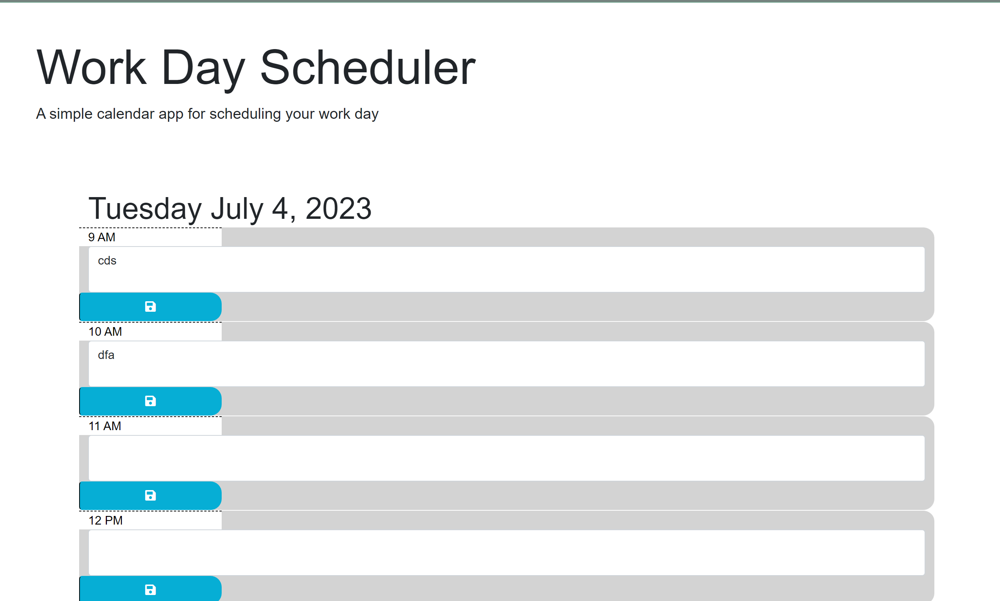
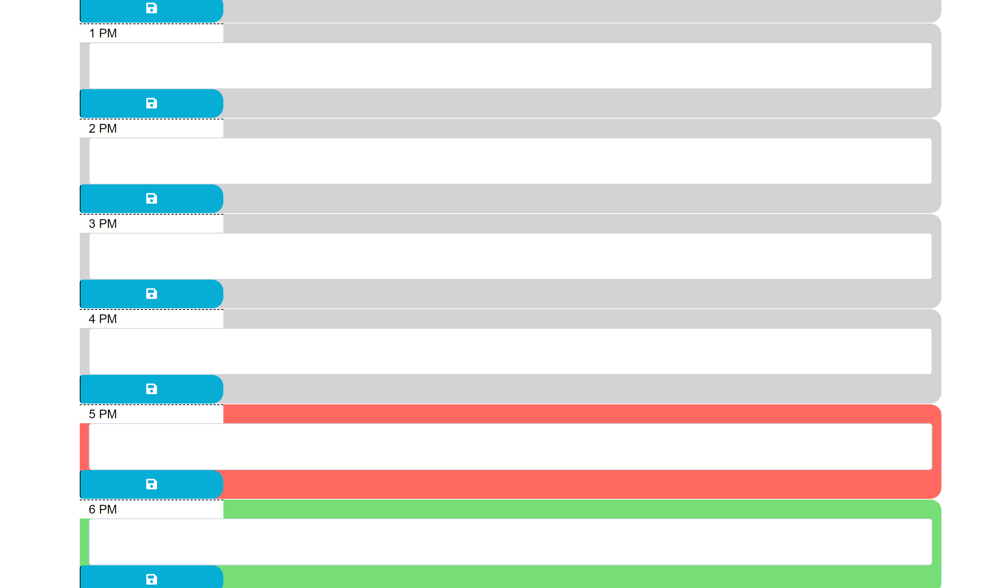

# Day Planner

The Work Day Scheduler is a simple calendar app for scheduling your work day. It allows you to plan and organize your tasks throughout the day.

## Features

- Displays the current weekday and date.
- Provides time blocks from 9 AM to 5 PM for entering tasks.
- Automatically highlights the current hour and distinguishes past, present, and future time blocks.
- Allows you to save tasks entered in each time block.
- Uses local storage to persist task data even after refreshing the page.

## Technologies Used

- HTML
- CSS (Bootstrap for styling)
- JavaScript (jQuery and Moment.js libraries)

## Getting Started

1. Clone or download the project repository.
2. Open the `index.html` file in a web browser.
3. The calendar will be displayed, and you can start entering tasks in the respective time blocks.
4. Click the save button next to each time block to save your task.
5. Saved tasks will be persisted even after refreshing the page.
